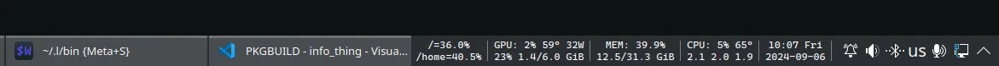

# Info Thing

A small program for printing formatted system information to stdout, meant to be used with [Command Output](https://store.kde.org/p/2136636) KDE widget



## Installation

```console
$ ./build.sh
```

This installs the `info_thing` executable to `~/.local/bin` (so don't run this script with root privileges)

## Usage

```console
$ # INFO can be one of: memory, disk, gpu, cpu
$ info_thing <INFO>
```