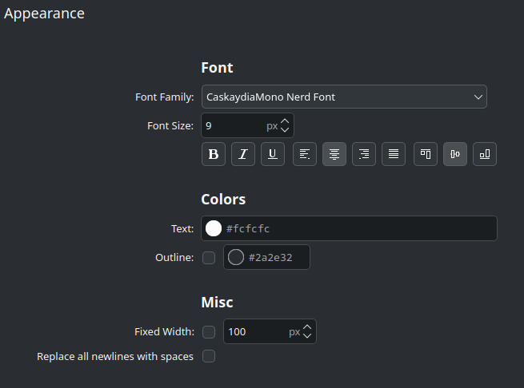

# Info Thing

A small program for printing formatted system information to stdout, meant to be used with the [Command Output](https://store.kde.org/p/2136636) KDE widget


Tweaking the formatting of the text is done by editing the source code

## Building

```console
$ cargo build
```

## Installation

```console
$ ./install.sh
```

This installs the `info_thing` executable to `~/.local/bin` (so don't run this script with `sudo`)

## Usage

```console
$ info_thing cpu
CPU: 2% 44°
0.8 0.8 1.2

$ info_thing mounts / /home
/=35.9%
/home=40.8%
```

## Using with Command Output widget

Set the command like so, and set the interval, I have all of mine running every 1000ms (1 second)


Make sure the the font size is small enough so that 2 lines can be drawn, and make the text centered

